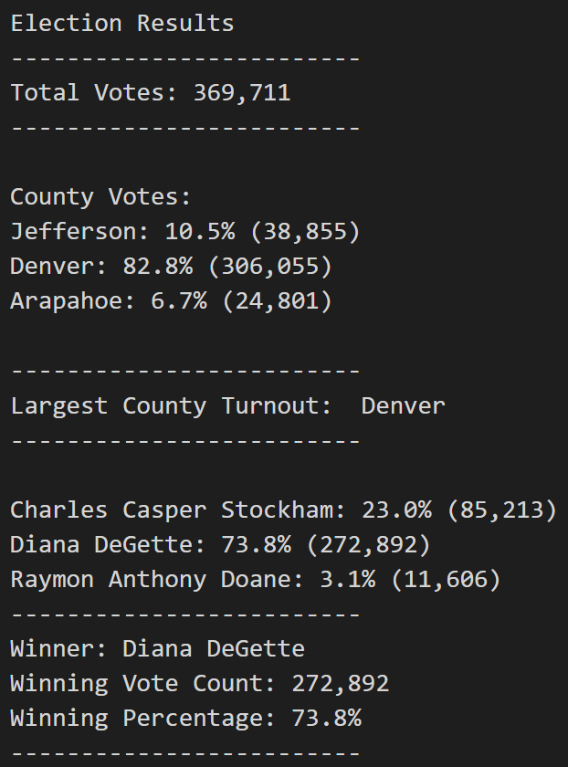

# Election_Analysis
## Project Overview 
Colorado Board of Elections has given the following tasks to complete the election audit of a recent local congressional election.

1. Calculate the total number of votes cast.
2. County that had the largest number of votes. 
3. Calculate the total number of votes each candidate received.
4. Calculate the percentage of votes each candidate won.
5. Determine the winner of the election based on popular vote.

## Resources 
- Data Source: election_results.csv
- Software: Python 3.8.6, Visual Studio Code 1.58.0

## Summary 
The analysis of the election show that: 
- There were 369,711 votes cast in the election.
- Denver is the county that had the largest number of votes. 
- The candidate results were: 
  - Charles Casper Stockham received 23.0% of the vote and 85,213 number of votes. 
  - Diana DeGette received 73.8% of the vote and 271,892 number of votes. 
  - Raymon Anthony Doane received 3.1% and 11,606 number of votes. 
- The winner of the election was: 
  - Diana DeGette, who received 73.8% of the vote and 271,892 number of votes. 

## Challenge Summary
The script created using Python is ideal for automating counting the votes casted in the election and getting additional data. Once the csv file is uploaded with the data, the script created is able to report on the total number of votes cast, largest number of votes, percentages by candidate, and determing the winner of the election. The script also provides the amount of votes per county, which is helpful to see the counties with low turnout rates to plan a strategy to increase voter turnout in the future. It is recommended that the Colorado Board of Elections keeps using the script in future elections and builds on the data collected and presented. 
